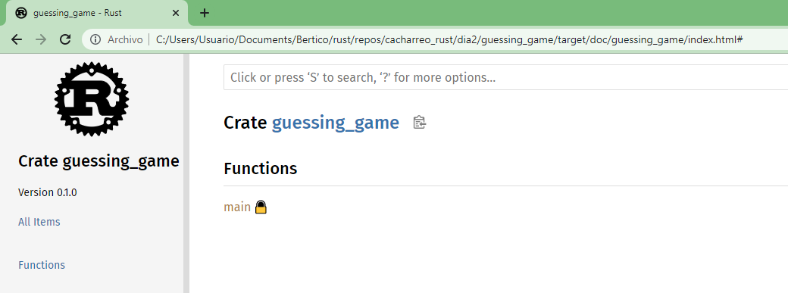

# Dia 2

## Actividades 

- [ ] Capitulo 2 del libro ([Programming a Guessing Game](https://doc.rust-lang.org/book/ch02-00-guessing-game-tutorial.html))


### Actividad 2 - Programming a Guessing Game

Antes de empezar vamos a tener a la mano la referencia: [Rust Language Cheat Sheet](https://cheats.rs/)

Aqui se veran algnos conceptos básicos que se usaran cuando se codifica un programa:
* ```let```
* ```match```
* Metodos
* Funciones asociadas.
* Uso de dependencias externas (external crates)

**Problema - Juego de adivinanzas**

Un programa genera un número entero aleatorio entre 1 y 100 para luego pedir al jugador adivine el valor ingresando el dato por teclado. Después de que el jugador ingresa el valor, el programa indicará si el valor esta por encima o por debajo. Si el jugador le atina al valor, el juego imprimirá un mensaje de felicitación y saldrá.

**Pasos**

1. Configuración del proyecto

```
$ cargo new guessing_game
$ cd guessing_game
```

2. Test inicial

```
$ cargo run
```

3. Codificación del programa:

* **Archivo**: [main.rs](./guessing_game/src/main.rs)

```rs
use std::io;

fn main() {
    println!("Guess the number!");

    println!("Please input your guess.");

    let mut guess = String::new();

    io::stdin()
        .read_line(&mut guess)
        .expect("Failed to read line");

    println!("You guessed: {guess}");
}
```

**Sobre la librerias**:

|Libreria|nombre|Comentarios|
|---|---|---|
|Estandar|```std```||
|I/O|```std::io```|Modulo ```io``` Se encuentra dentro de ```std```|
|rand|```rand::Rng```|Se debe agregar en el archivo **Cargo.toml** la ```rand``` crate como dependencia (```rand = "0.8.3"```).|

Para actualizar las librerias que esta usando use ```cargo update```, con esto se .

**Salida en pantalla**:

Se usa ```println!``` la cual es una macro que imprime un string en pantalla.

Mediante el uso de las llaves se puede imprimir el valor de una variable.

```rs
println!("You guessed: {guess}");
```

Para imprimir mas de una variable, puede basarse en el fragmento de codigo mostrado a continuación:

```rs
let x = 5;
let y = 10;

println!("x = {} and y = {}", x, y);
```

**Declaración de variables**:

Para declara variables se usa ```let```. En Rust, las variables son inmutables por defecto (una vez creadas no pueden cambiar de valor). Para hacer que estas puedan modificarse se debe agregar ```mut``` antes del nombre de la variable.

```rs
let apples = 5; // immutable
let mut bananas = 5; // mutable
```

Para crear una variable tipo ```String``` (Mas exactamente una instancia tipo ```String```), ```new``` es una **función asociada** a un tipo (en este caso String); para este caso parece que fuera algo como el metodo constructor o algo asi ```???```. El ```::``` indica a lo que se asocia el la función.

```rs
let mut guess = String::new();
```

**Entrada de datos**:

Se usa la función ```stdin``` que se encuentran dentro del modulo ```io``` de ```std``` , la parte ```read_line(&mut guess)``` llama al metodo ```read_line```, al usar ```&mut guess``` decimos donde se almacenará lo que se ingresa por teclado. El ```&``` significa que el argumento pasado es una referencia. Se escribe ```&mut guess``` en vez de ```&guess``` para indicar que la variable es mutable.

```rs
io::stdin()
    .read_line(&mut guess)
```

Como puede haber una potencial falla cuando de acuerdo al tipo de resultado se agrega:

```rs
.expect("Failed to read line");
```

Asi, la expresión completa para entrar un dato por teclado queda:

```rs
io::stdin().read_line(&mut guess).expect("Failed to read line");
```

Pero lo ideal es escribir la espresión dividiendola, usando **```.method_name()``` syntax**

**Generación de numeros aletorios**:

Rust no incluye la funcionalidad para la generación de numeros aleatorios en su libreria estandar. En vez de ello, proporciona una **rand crate** con esta funcionalidad.

>
> **crate**<br> 
> Es una colección de archivos fuente de rust. El **rand crate** es una libreria crate la cual contiene codigo que será usado por otros programas. 
> 

```rs
use std::io;
use rand::Rng;

fn main() {
    println!("Guess the number!");

    let secret_number = rand::thread_rng().gen_range(1..=100);

    println!("The secret number is: {secret_number}");

    println!("Please input your guess.");

    let mut guess = String::new();

    io::stdin()
        .read_line(&mut guess)
        .expect("Failed to read line");

    println!("You guessed: {guess}");
}
```

**Generando la documentación del programa**

```
cargo doc --open
```



## Referncias


* https://prev.rust-lang.org/es-ES/documentation.html
* https://reberhardt.com/cs110l/spring-2020/
* https://events.static.linuxfound.org/sites/events/files/slides/rust-4-cpp2.pdf
* https://static.linaro.org/connect/lvc21f/presentations/LVC21F-317.pdf
* https://docs.google.com/presentation/d/1Xrzj8Ul690fJr6MjfNWOiF2mPKsVwX1g4FCLtOT-vdQ/edit#slide=id.g4b027f704f_1_174
